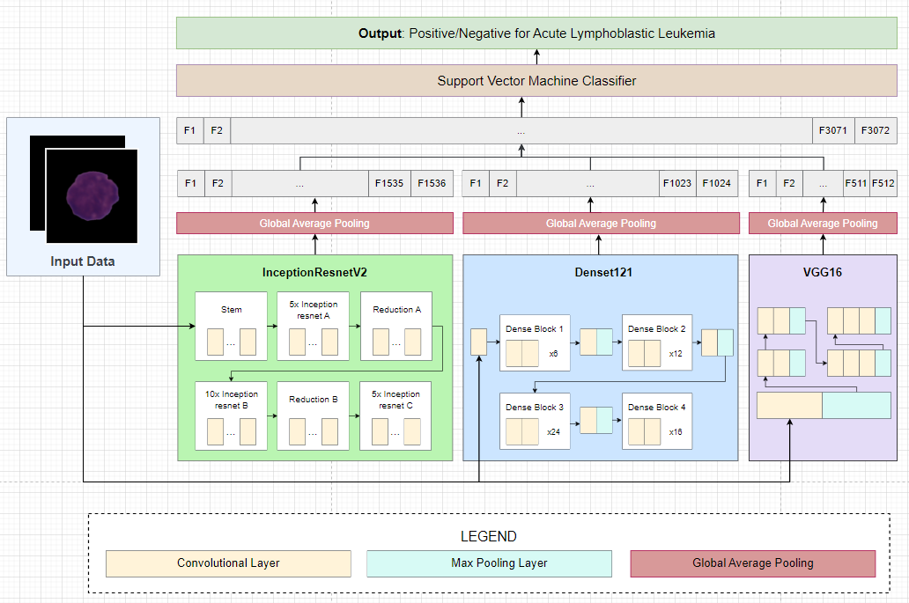

# Acute Lymphoblastic Cell Classification using Deep Learning

Methodology for classifying Acute Lymphoblastic Leukemia (ALL) versus normal cells based on image data. The approach involves two stages: feature extraction and classification. Three state-of-the-art transfer learning models, InceptionResnetV2, Densenet121, and VGG16, are utilized to extract features from the images. The extracted features are then processed through a Global Average Pooling layer and concatenated into a flattened tensor. A linear Support Vector Machine (SVM) classifier is trained and tested on the resulting feature set. Performance evaluation is conducted using metrics such as Precision, Accuracy, Recall, and F-measure. The experimental results demonstrate the efficacy of the proposed approach, with the highest accuracy achieved at 91.57% when merging features from VGG16, InceptionResNetV2, and DenseNet121. This study contributes to the field by offering a robust methodology for accurate classification and highlights the potential of transfer learning models in medical image analysis. The findings provide valuable insights for the development of automated systems for early detection and diagnosis of leukemia.

### Approach 

 
